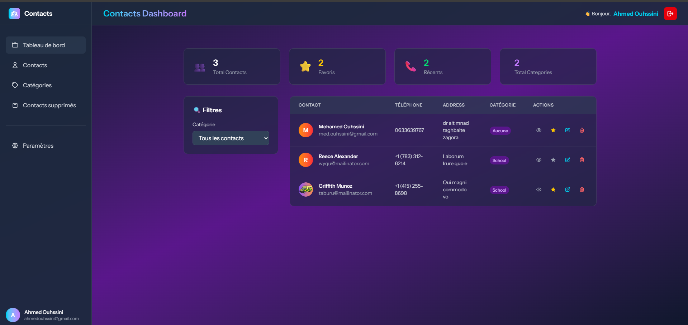
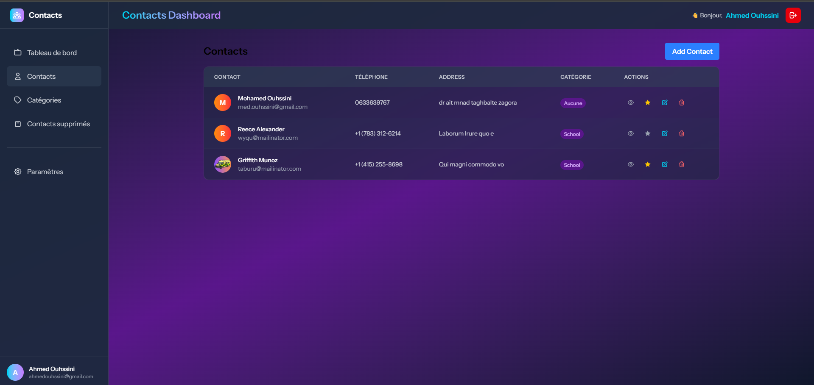
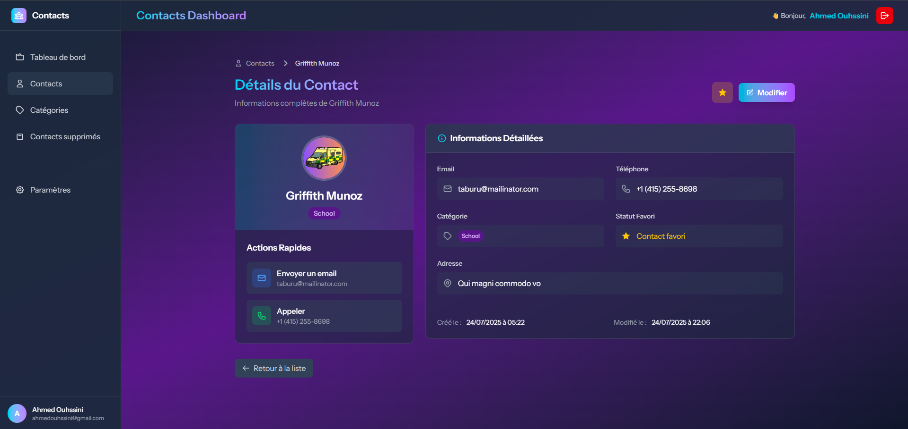
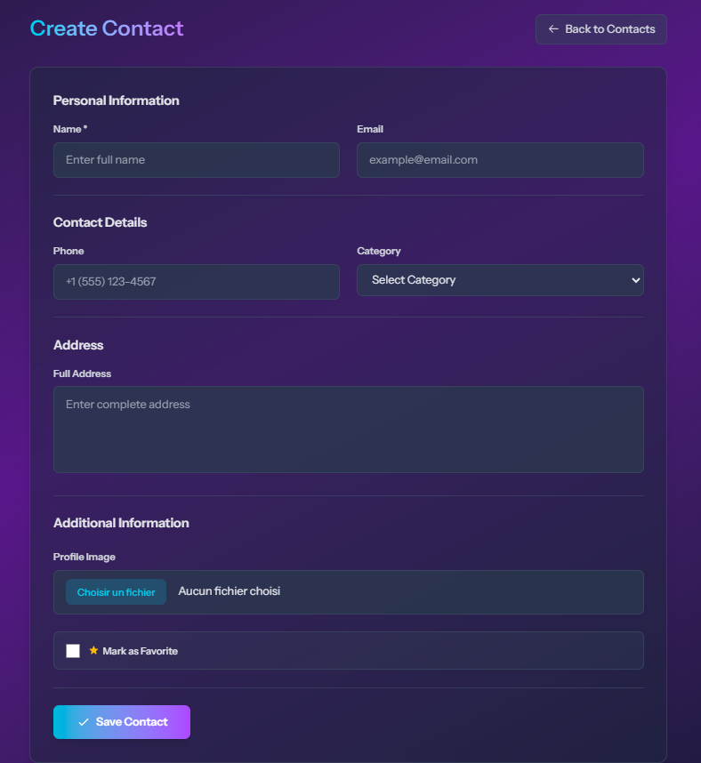
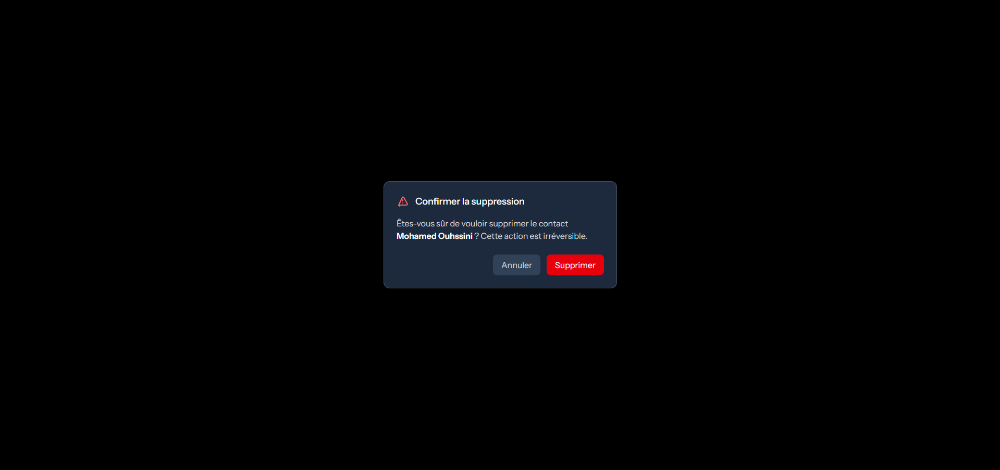
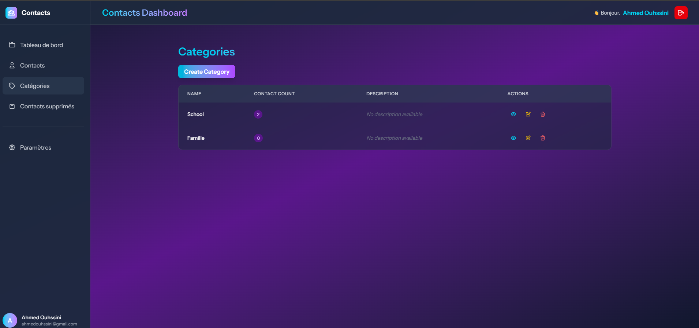
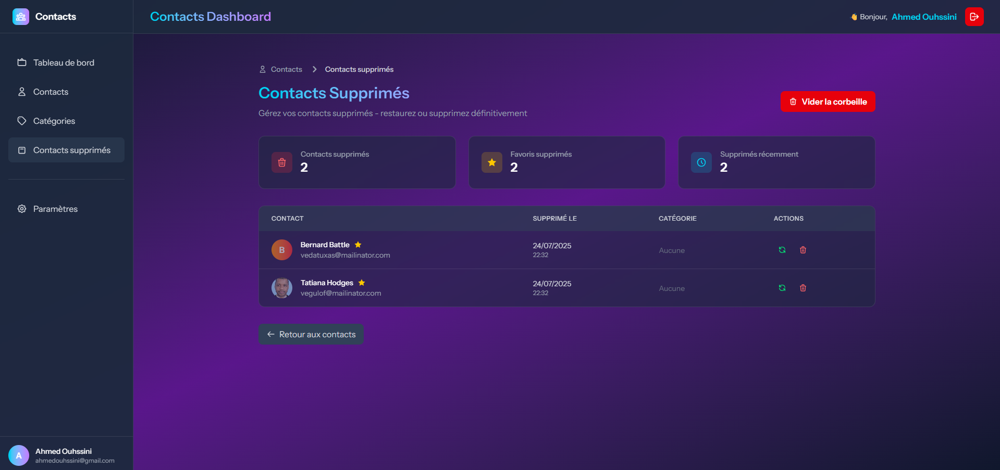
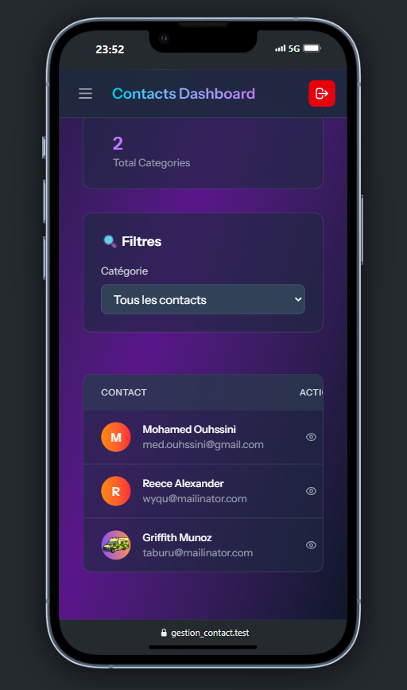

# 📱 Gestion Contact - Modern Contact Management System

A beautiful, modern contact management application built with Laravel and styled with a stunning dark theme dashboard. Manage your contacts efficiently with categories, favorites, search functionality, and a complete trash system.

## ✨ Features

### 🎨 Beautiful Dark Theme Dashboard
- **Modern Glass-morphism Design**: Backdrop blur effects with translucent elements
- **Gradient Accents**: Cyan to purple gradients throughout the interface
- **Responsive Layout**: Perfect on desktop, tablet, and mobile devices
- **Smooth Animations**: Micro-interactions and hover effects for enhanced UX

### 👥 Contact Management
- **Complete CRUD Operations**: Create, read, update, and delete contacts
- **Profile Images**: Upload and manage contact photos with real-time preview
- **Contact Details**: Store name, email, phone, address, and category
- **Favorite System**: Mark important contacts as favorites with star indicators
- **Category Organization**: Organize contacts into custom categories

### 🗂️ Category System
- **Custom Categories**: Create and manage your own contact categories
- **Contact Counting**: See how many contacts are in each category
- **Category Assignment**: Easily assign contacts to categories
- **Visual Indicators**: Color-coded category badges

### 🗑️ Advanced Trash System
- **Soft Delete**: Contacts are moved to trash instead of permanent deletion
- **Restore Functionality**: Easily restore accidentally deleted contacts
- **Permanent Delete**: Option to permanently remove contacts when needed
- **Bulk Operations**: Empty entire trash with confirmation
- **Trash Statistics**: See deleted contacts count and recent deletions

### 🔐 User Authentication
- **User Registration**: Create new accounts with validation
- **Secure Login**: Password authentication with remember me option
- **Session Management**: Secure logout and session handling
- **User Isolation**: Each user sees only their own contacts and categories

### 📱 Responsive Design
- **Mobile-First**: Optimized for mobile devices
- **Adaptive UI**: Interface adapts to different screen sizes
- **Touch-Friendly**: Large touch targets for mobile interaction
- **Collapsible Sidebar**: Mobile-friendly navigation

### 🔍 Search & Filter (Coming Soon)
- **Real-time Search**: Find contacts instantly as you type
- **Category Filtering**: Filter contacts by category
- **Favorite Filtering**: Show only favorite contacts
- **Advanced Filters**: Multiple filter combinations

## 🛠️ Technology Stack

### Backend
- **Laravel 11**: Modern PHP framework with elegant syntax
- **MySQL**: Reliable database for data storage
- **Eloquent ORM**: Beautiful, simple ActiveRecord implementation
- **Laravel Validation**: Robust form validation system
- **Soft Deletes**: Built-in soft delete functionality

### Frontend
- **Blade Templates**: Laravel's powerful templating engine
- **Tailwind CSS**: Utility-first CSS framework
- **Custom JavaScript**: Vanilla JS for enhanced interactions

### Design System
- **Dark Theme**: Professional dark color scheme
- **Glass-morphism**: Modern backdrop blur effects
- **Consistent Icons**: Heroicons for visual consistency
- **Typography**: Carefully chosen font weights and sizes
- **Color Palette**: Slate, cyan, and purple accent colors

## 📸 Screenshots

### Dashboard Overview


### Contact List View



### Contact Details Page



### Contact Form (Create/Edit)


### Delete Confirmation alert



### Category Index



### Category Details Page


### Trash Management


### Responsive Mobile View



## 🚀 Installation

### Prerequisites
- PHP 8.1 or higher
- Composer
- Node.js & NPM
- MySQL or SQLite
- Web server (Apache/Nginx) or use Laravel's built-in server

### Step-by-Step Installation

1. **Clone the repository**
   ```bash
   git clone https://github.com/ouhssini/gestion_contact.git
   cd gestion_contact
   ```

2. **Install PHP dependencies**
   ```bash
   composer install
   ```

3. **Install JavaScript dependencies**
   ```bash
   npm install
   ```

4. **Environment setup**
   ```bash
   cp .env.example .env
   php artisan key:generate
   ```

5. **Database configuration**
   Edit `.env` file with your database credentials:
   ```env
   DB_CONNECTION=mysql
   DB_HOST=127.0.0.1
   DB_PORT=3306
   DB_DATABASE=gestion_contact
   DB_USERNAME=your_username
   DB_PASSWORD=your_password
   ```

6. **Run database migrations**
   ```bash
   php artisan migrate
   ```

7. **Seed the database (optional)**
   ```bash
   php artisan db:seed
   ```

8. **Build frontend assets**
   ```bash
   npm run build
   ```

9. **Create storage symlink**
   ```bash
   php artisan storage:link
   ```

10. **Start the development server**
    ```bash
    php artisan serve
    ```

Visit `http://localhost:8000` to access the application.

## 📁 Project Structure

```
gestion_contact/
├── app/
│   ├── Http/
│   │   ├── Controllers/
│   │   │   ├── AuthController.php
│   │   │   ├── ContactController.php
│   │   │   └── CategoryController.php
│   │   └── Requests/
│   ├── Models/
│   │   ├── User.php
│   │   ├── Contact.php
│   │   └── Category.php
│   └── Policies/
├── database/
│   ├── migrations/
│   ├── factories/
│   └── seeders/
├── resources/
│   ├── views/
│   │   ├── Layout/
│   │   │   ├── Main.blade.php
│   │   │   └── Dashboard.blade.php
│   │   ├── auth/
│   │   ├── contacts/
│   │   ├── categories/
│   │   └── components/
│   ├── css/
│   └── js/
└── routes/
    ├── web.php
    └── console.php
```

## 🎯 Key Features Breakdown

### Contact Management System

#### Create Contact
- **Modern Form Design**: Beautiful form with real-time validation
- **Image Upload**: Drag & drop or click to upload profile pictures
- **Category Selection**: Dropdown with user's custom categories
- **Favorite Toggle**: Mark as favorite during creation
- **Address Support**: Multi-line address field

#### View Contact
- **Two-Column Layout**: Profile card and detailed information
- **Quick Actions**: Direct email and phone links
- **Edit Access**: Quick access to edit form
- **Favorite Status**: Visual indication with star icon
- **Responsive Design**: Adapts to mobile screens

#### Edit Contact
- **Pre-filled Forms**: Current data loaded for editing
- **Image Preview**: See current image and preview new uploads
- **Validation Feedback**: Real-time error messages
- **Navigation Options**: Multiple ways to navigate back

### Category Management

#### Category Organization
- **Custom Categories**: Create categories that match your workflow
- **Contact Counting**: See how many contacts are in each category
- **Visual Indicators**: Color-coded badges for easy identification
- **Management Actions**: Edit, delete, and view category contents

### Trash & Recovery System

#### Soft Delete Protection
- **Safe Deletion**: Contacts moved to trash instead of permanent deletion
- **Recovery Options**: Restore accidentally deleted contacts
- **Bulk Operations**: Empty entire trash when ready
- **Time Tracking**: See when contacts were deleted

## 🔒 Security Features

### Authentication & Authorization
- **User Registration**: Secure account creation with validation
- **Password Security**: Minimum requirements and hashing
- **Session Management**: Secure login sessions
- **Data Isolation**: Users can only access their own data

### Input Validation
- **Form Validation**: Server-side validation for all inputs
- **File Upload Security**: Image validation and safe storage
- **XSS Protection**: Built-in Laravel security features
- **CSRF Protection**: Token-based form protection

## 🎨 Design Philosophy

### Dark Theme Implementation
- **Professional Aesthetic**: Dark color scheme for reduced eye strain
- **Consistent Branding**: Unified color palette throughout
- **Visual Hierarchy**: Clear information structure
- **Accessibility**: High contrast ratios for readability

### User Experience
- **Intuitive Navigation**: Clear menu structure and breadcrumbs
- **Feedback Systems**: Toast notifications for user actions
- **Error Handling**: Graceful error messages and recovery
- **Performance**: Optimized loading and smooth interactions

## 🚀 Future Enhancements

### Planned Features
- [ ] **Advanced Search**: Full-text search across all contact fields
- [ ] **Import/Export**: CSV import and export functionality
- [ ] **Contact Sharing**: Share contacts between users
- [ ] **API Integration**: REST API for mobile app integration
- [ ] **Backup System**: Automated data backup and restore
- [ ] **Custom Fields**: User-defined contact fields
- [ ] **Contact History**: Track changes and interactions
- [ ] **Email Integration**: Send emails directly from the app

### Technical Improvements
- [ ] **Real-time Updates**: WebSocket integration for live updates
- [ ] **Caching**: Redis integration for improved performance
- [ ] **Testing**: Comprehensive test coverage
- [ ] **Docker**: Containerization for easy deployment
- [ ] **CI/CD**: Automated testing and deployment pipeline

## 🤝 Contributing

We welcome contributions to improve the Contact Management System!

### How to Contribute

1. **Fork the repository**
2. **Create a feature branch**
   ```bash
   git checkout -b feature/amazing-feature
   ```
3. **Make your changes**
4. **Commit your changes**
   ```bash
   git commit -m 'Add some amazing feature'
   ```
5. **Push to the branch**
   ```bash
   git push origin feature/amazing-feature
   ```
6. **Open a Pull Request**

### Development Guidelines

- Follow Laravel coding standards
- Write clear commit messages
- Include tests for new features
- Update documentation when needed
- Ensure responsive design principles

## 📄 License

This project is open-sourced software licensed under the [MIT license](https://opensource.org/licenses/MIT).

## 👨‍💻 Author

**Ouhssini**
- GitHub: [@ouhssini](https://github.com/ouhssini)
- Email: [ahmedouhssini@gmail.com](mailto:ahmedouhssini@gmail.com)

## 🙏 Acknowledgments

- **Laravel Team**: For the amazing framework
- **Tailwind CSS**: For the utility-first CSS framework
- **Heroicons**: For the beautiful icon set
- **Community**: For inspiration and feedback

## 📞 Support

If you encounter any issues or have questions:

1. **Check the Issues**: Look for existing solutions in GitHub Issues
2. **Create an Issue**: Report bugs or request features
3. **Documentation**: Refer to Laravel documentation for framework-specific questions
4. **Community**: Join Laravel community forums for general help

---

**Made with ❤️ by Ouhssini using Laravel and Tailwind CSS**

*This project demonstrates modern web development practices with a focus on user experience, security, and maintainable code.*
